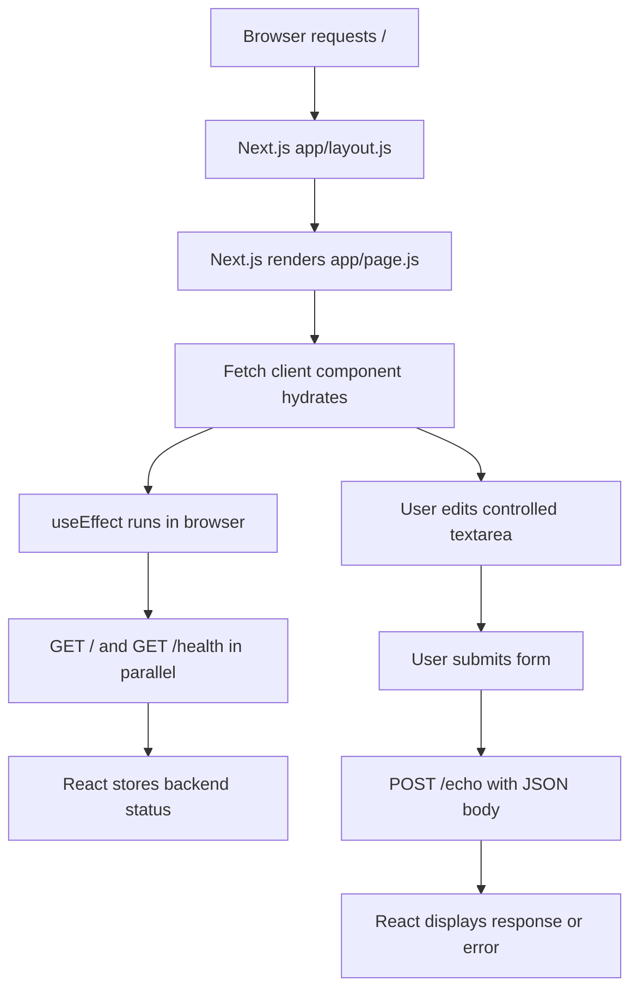

# Next.js App Flow

This app is a Next.js App Router frontend. It uses the shared FastAPI backend
running on `http://localhost:8000`.

## Frontend flow



1. The browser requests `/` from the Next.js development server.
2. `app/layout.js` provides the root HTML structure and imports
   `app/globals.css`.
3. `app/page.js` renders the page heading and the `Fetch` component.
4. `app/fetch.js` is marked `'use client'` because it uses state, effects, and
   browser `fetch` calls.
5. After the client component mounts, `useEffect` starts `GET /` and
   `GET /health` with `Promise.all`.
6. Successful responses update `rootMessage` and `healthStatus`.
7. The cleanup function aborts pending status requests if the component
   unmounts.
8. The textarea is controlled by the `payload` state.
9. Form submission prevents a page reload and sends the payload to `POST /echo`.
10. The returned JSON is stored in `echoResponse` and rendered as formatted JSON.

## Shared backend flow

The backend is defined in `../backend/main.py` and runs with FastAPI on port
`8000`.

| Method | Path | Purpose | Response |
| --- | --- | --- | --- |
| `GET` | `/` | Confirms the backend is running | `{ "message": "Demo backend is running" }` |
| `GET` | `/health` | Reports service health | `{ "status": "ok" }` |
| `POST` | `/echo` | Accepts a JSON object and returns it | `{ "data": <request body> }` |

FastAPI's CORS middleware allows requests from both frontend development
servers:

- `http://localhost:3000` and `http://127.0.0.1:3000` for Next.js
- `http://localhost:5173` and `http://127.0.0.1:5173` for Vite

## Error handling

- Failed startup requests show the error message and set health to
  `Unavailable`.
- An aborted startup request is ignored.
- Failed echo requests show the backend `detail`, HTTP status, or network error.

## Styling

- `app/globals.css` is imported by `app/layout.js` and styles the page,
  textarea, button, response, typography, and responsive layout.
- The styling is global because the current components use ordinary HTML
  elements rather than CSS Modules.

## Run locally

Start the backend:

```bash
cd ../backend
python main.py
```

Start this frontend:

```bash
cd my-app
npm run dev
```

Open `http://localhost:3000`.

## Difference from React_Frontend

This frontend uses Next.js App Router. Next.js owns the route and root layout,
while `Fetch` becomes interactive in the browser after hydration. The Vite app
starts from `src/main.jsx` and mounts the complete React tree in the browser.

Both frontends use the same API URLs, request methods, JSON payload shape,
state behavior, and backend error handling.
